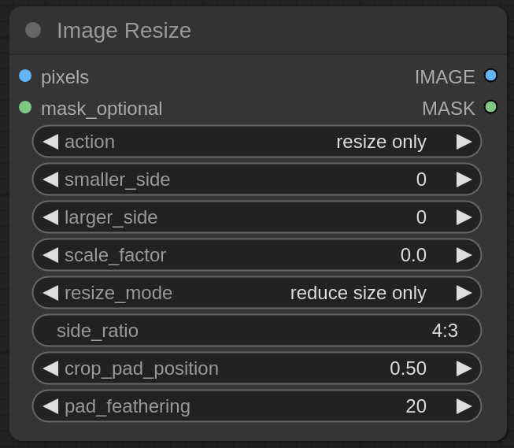

# Image Resize for ComfyUI

This custom node provides various tools for resizing images. The goal is resizing without distorting proportions, yet without having to perform any calculations with the size of the original image. If a mask is present, it is resized and modified along with the image.

## Installation

To install, clone this repository into `ComfyUI/custom_nodes` folder with `git clone https://github.com/palant/image-resize-comfyui` and restart ComfyUI.

## Node configuration

### action

In the `resize only` mode, the image will only be resized while keeping its side ratio. The `side_ratio` setting is ignored then.

In the `crop to ratio` mode, parts of the image will be removed after resizing as necessary to make its side ratio match `side_ratio` setting.

In the `pad to ratio` mode, transparent padding will be added to the image after resizing as necessary to make its side ratio match `side_ratio` setting.

### smaller_side, larger_side, scale_factor

These settings determine the image’s target size. Only one of these settings can be enabled (set to a non-zero value).

With `smaller_side` set, the target size is determined by the smaller side of the image. E.g. with the `action` being `resize only` and the original image being 512x768 pixels large, `smaller_side` set to 1024 will resize the image to 1024x1536 pixels.

With `larger_side` set, the target size is determined by the larger side of the image. E.g. with the `action` being `resize only` and the original image being 512x768 pixels large, `larger_side` set to 1024 will resize the image to 683x1024 pixels.

Finally, `scale_factor` can be set as an explicit scaling factor. Values below 1.0 will reduce image size, above 1.0 increase it.

If neither setting is set, the image is not resized but merely cropped/padded as necessary.

### resize_mode

In the `reduce size only` mode, images already smaller than the target size will not be resized. In the `increase size only` mode, images already larger than the target size will not be resized. The `any` mode causes the image to be always resized, regardless of whether downscaling or upscaling is required.

### side_ratio

If the `action` setting enables cropping or padding of the image, this setting determines the required side ratio of the image. The format is `width:height`, e.g. `4:3` or `2:3`.

In case you want to resize the image to an explicit size, you can also set this size here, e.g. `512:768`. You then set `smaller_side` setting to `512` and the resulting image will always be 512x768 pixels large.

### crop_pad_position

If the image is cropped, this setting determines which side is cropped. The value `0.0` means that only the right/bottom side is cropped. The value `1.0` means that only left/top side is cropped. The value `0.3` means that 30% are being cropped on the left/top side and 70% on the right/top side.

If the image is padded, this setting determines where the padding is being inserted. The value `0.0` means that all padding is inserted on the right/bottom side. The value `1.0` means that all padding is inserted on the left/top side. The value `0.3` means that 30% of the padding are inserted on the left/top side and 70% on the right/top side.

### pad_feathering

If the image is padded, this setting causes mask transparency to partially expand into the original image for the given number of pixels. This helps avoid borders if the image is later inpainted.
